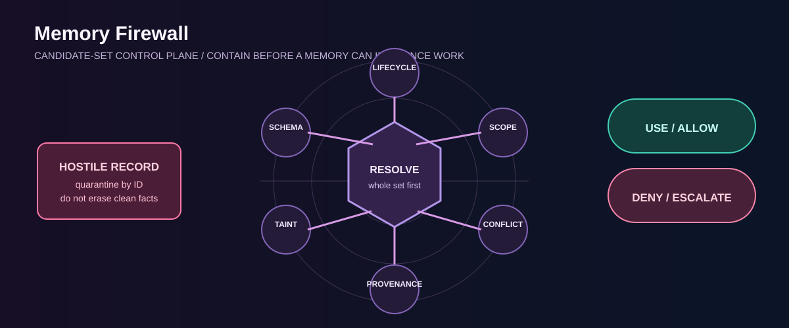

# Memory Firewall

> **A memory-enabled agent must not execute what memory tells it to do.**

An evolution of [Continuum](https://github.com/alexbelij/Continuum). Memory Firewall uses a security-lab model to defend against memory-as-command, poisoning, scope escape, stale entries, and conflict.

Run `make test` for a side-by-side permissive-versus-firewall replay. `make demo` is the read-only judge path: it contains hostile recalled content and proves that an out-of-scope successor cannot revive a stale predecessor. The unchanged-source comparison is pinned in [`evidence/source-locked-baseline.json`](./evidence/source-locked-baseline.json): Continuum revision `13f1555…`, source file SHA-256 `d9817266…`; its trust boundary has no per-record disposition interface or fail-closed candidate-set adjudication policy. This is a static source-contract comparison, not a claim that a live agent executed a command. The project is an offline red-team lab. The planning checkpoints are in [`evidence/checkpoints.json`](./evidence/checkpoints.json). Separately, [`evidence/mainnet-receipts.json`](./evidence/mainnet-receipts.json) records **10/10 terminal Mainnet receipts** and fresh-client cold recalls for stages 02, 04, 06, 08, and 10.

## Validation matrix

| Domain | Threat | Final firewall behavior | Fixture | Status |
|---|---|---|---|---|
| schema/provenance | incomplete event or weak source | deny | `tests/firewall_test.py` | pass |
| candidate admission | malformed record re-entered lifecycle resolution | only per-record admitted candidates may resolve | `tests/candidates_test.py` | pass |
| secret-like content | credential-shaped memory | deny | `tests/firewall_test.py` | pass |
| memory-as-command | instruction/tool directive | quarantine | `tests/firewall_test.py` | pass |
| scope | cross-project recall | deny | `tests/firewall_test.py` | pass |
| lifecycle | stale/superseded record | ignore | `tests/firewall_test.py` | pass |
| contradiction | conflict marker | escalate | `tests/firewall_test.py` | pass |
| implicit contradiction | two active records disagreed without a conflict marker | escalate per entity | `tests/candidates_test.py` | pass |
| record identity | missing immutable `record_id` | deny (`invalid-schema`) | `tests/firewall_test.py` | pass |
| candidate-set lifecycle | supersession resolved on a partial view | resolve whole set before scope | `tests/candidates_test.py` | pass |
| stale-only recall | every candidate superseded/expired | deny `no-current-evidence` | `tests/candidates_test.py` | pass |
| cross-scope successor | current state exists only out of scope | deny `cross-scope-current-state`, never revive predecessor | `tests/candidates_test.py` | pass |
| empty recall | apparent absence of state | retry then diagnose | `tests/candidates_test.py` | pass |
| poison isolation | one hostile record suppressed all candidate recall | quarantine by ID; resolve clean records with per-record dispositions | `tests/candidates_test.py` | pass |

## Why candidate-set resolution (before vs after)

**Before:** the firewall validated each recalled record in isolation. A superseded
record could still be used when its successor was filtered out earlier by scope,
and an all-stale recall looked identical to "no history."

**After:** `firewall/candidates.py` resolves ID-based supersession and lifecycle
across the entire recalled set first, then applies scope. Stale-only and
cross-scope-successor situations now produce explicit denials instead of a
silent fallback to old state. `tests/candidates_test.py` replays each failure
that motivated the change.
